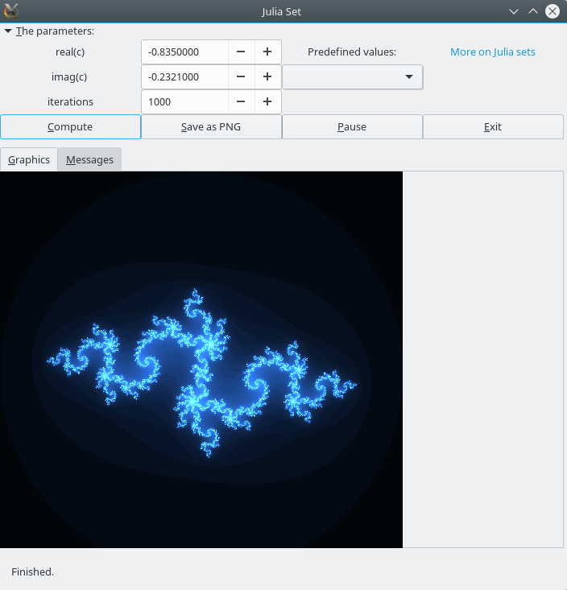

# Summary

Fortran is still much used in research because it is suited by design to scientific computing and there is a lot of legacy code written in this language. But contrary to more recent languages like Python, it offers no native solution for graphical visualization or graphical user interfaces (GUI). However, the visualization of scientific data is essential for researchers to interpret and explore their results. Real-time visualization of modelling can save a lot of time when the computing time is long: the user can interrupt the execution if an error is detected or if he wants to tweak some parameters to explore other solutions. And a GUI can bring interactivity to the model, allowing the scientist to modify the value of a parameter and see its effects in real-time [@hunger2008], which can even bring new possibilities to legacy code [@Tincher2017]. It can also ease the use of the research software by colleagues inside or outside the laboratory.

But despite the venerable age of Fortran, few solutions exist in this language [@markus2012; @metcalf2011] and are often limited in their functionalities or are not open source, or not cross-platform, etc. For example, you can plot results with PLplot but not create a GUI [@plplot],  DISLIN has a restrictive licence [@dislin], Intel Visual Fortran offers some interesting features for GUI and graphics but is limited to the Microsoft Windows operating system and is commercial software [@visual_fortran]...

Gtk-fortran [@gtk_fortran] is a GTK+ / Fortran binding using the ISO\_C\_BINDING intrinsic module for interoperability between C and Fortran defined since the Fortran 2003 standard [@markus2012; @metcalf2011; @fortran]. Although gtk-fortran development is mainly focused on Linux, it can also be built under Windows, Mac OS X... It is licensed under the GNU General Public License version 3. It offers interfaces to around 10000 GTK+ and GLib functions [@gtk], and also to the PLplot library.  A higher-level interface (at a level comparable to the widget routines available in IDL [@idl]) has been developed to offer an easier access to the main GTK+ widgets. The gtkf-sketcher tool even makes easier the design of a complex GTK+3 GUI by automatically generating the Fortran code from the XML files created by the user interface designer software Glade [@glade].

Moreover, even though gtk-fortran was mainly developed to visualise computing results and build GUIs, Fortran developers can also access the large set of utility functions offered by the GLib library. They can for example implement visual management of tree-like data structures for handling of complex data projects. Along the wiki documentation of the project, the user can learn to use gtk-fortran thanks to tens of various example programs available in the repository.

Among the publicly available research softwares using gtk-fortran, we can cite for example UncertRadio [@Kanisch2016], designed for a generalized evaluation of environmental radioactivity measurements, and the gene network editor NetworkMaker [@NetworkMaker] software. Coupling a modelling code with gtk-fortran can also be useful for teaching at the college level, for instance to simulate interactively the behaviour of a nuclear power plant [@Tincher2017].

The GTK+ and GLib libraries being in constant development, gtk-fortran is maintained to stay in tune with their evolutions. New projects should use GTK+ 3 but the GTK+ 2 version is still maintained, at least until the release of the future GTK+ 4.

# Acknowledgements

We would like to thank all those who have contributed in any way to the gtk-fortran project.

# References

